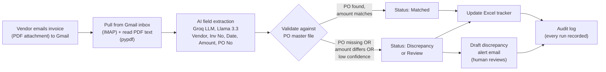

# Solution Design — Automated Invoice Processing & Validation

*Prepared for the Finance team · Invoice-to-PO matching workflow*

---

## 1. Problem (in business terms)

Today, vendor invoices arrive by email as PDF attachments, every vendor in a
different layout. A team member manually reads each invoice, copies out the key
fields, looks the Purchase Order (PO) up in our master file, updates the Excel
tracker, and emails someone whenever something doesn't line up. It works, but it's
slow, repetitive, and easy to get wrong — and the effort grows linearly with
invoice volume.

## 2. Proposed solution (plain language)

A small automation that does the boring 90% so a person only handles the
exceptions. For each incoming invoice it:

1. **Pulls** invoice PDFs straight from the Finance Gmail inbox, reads the text out
   of each PDF, and uses an AI model to extract Vendor, Invoice Number, Date, Amount
   and PO Number — coping with any vendor's format.
2. **Checks** the PO Number, Amount **and Vendor** against our PO master file
   (three controls: does the PO exist, does the amount agree, and is the invoice
   actually from the vendor that PO was raised for).
3. **Records** the result in the Excel tracker the team already uses.
4. **Flags** anything that doesn't match by drafting a clear alert email for a
   human to review.

The headline: **automation handles the matching; people focus only on the
exceptions.**

## 3. Architecture / flow

## 4. Tools & why

| Layer | Tool | Why this choice |
|------|------|-----------------|
| Field extraction | **Groq-hosted LLM (Llama 3.3 70B)** | Invoice formats vary wildly between vendors. An LLM reads all of them with **one prompt** — no per-vendor templates to build or maintain. Groq is **fast and free-tier friendly**, ideal for a prototype. **This is the key reason LLM > regex/rules here:** rules break the moment a vendor tweaks their layout; the LLM doesn't. |
| Validation & logic | **Python** | PO matching and amount comparison must be exact, deterministic and auditable. That's a job for plain code, *not* AI. Using AI only where it adds value is deliberate. |
| Tracker & data | **pandas + openpyxl** | Finance already works in Excel. The output is a normal `.xlsx` the team can open, filter and sort — zero new tools to learn. |
| Summary / UX | **tabulate** | A clean console summary so a run is readable at a glance. |

**Swappable by design:** the LLM provider is not locked in. Groq today; OpenAI,
Claude or a self-hosted model tomorrow — whatever the cost/accuracy trade-off
demands at scale. Likewise, the text-file inbox is a small step away from a real
**Outlook/Gmail inbox + Power Automate / n8n** trigger in production.

## 5. Assumptions

- **Invoices arrive as PDF attachments in a Gmail inbox.** The prototype connects to
  Gmail over IMAP (using an App Password) and reads the text out of each PDF with
  `pypdf`. This assumes **digitally-generated (text-based) PDFs**; scanned/image
  invoices would need an OCR step (e.g. Tesseract) — a known, well-supported addition.
- **Single currency** (INR). Multi-currency would add a normalisation step.
- **Matching is tolerance-based**: amounts match only if within a small flat
  Rs. 1 (rounding noise). Anything larger is flagged as a real mismatch - so a
  genuine overcharge is never auto-approved, even on a large invoice. (We avoid a
  percentage tolerance on purpose: 1% of a Rs. 10,00,000 PO is Rs. 10,000, which
  is real money, not rounding.)
- **One PO per invoice**, and the PO master is the source of truth.
- **Vendor matching is tolerant**: names are compared ignoring case, spacing and
  punctuation (so "APEX STEEL & ALLOYS PVT LTD" matches "Apex Steel & Alloys Pvt
  Ltd"), to avoid false flags on harmless formatting differences.
- **Happy-path prototype**: no auth, UI, or exhaustive edge-case handling — by
  design, per the brief.

## 6. Business impact estimate

**Assumptions (stated so they can be challenged):**

- Manual handling today ≈ **6 minutes/invoice** (read & extract ~2–3 min, PO lookup
  ~1–2 min, tracker update ~1 min, flag/email when needed ~1+ min).
- Volume ≈ **200 invoices/week** (a mid-size Finance team; adjust to actuals).
- With automation, a human only reviews the **~10–15% that get flagged**, at
  ~2 minutes each; the rest are touch-free.

**The math:**

| | Manual (today) | Automated |
|---|---|---|
| Time per invoice | ~6 min | ~seconds + review only on exceptions |
| 200 invoices/week | **~20 hours/week** | ~1 hour/week (review ~25 flagged × 2 min ≈ 50 min) |
| **Saved** | — | **~19 hours/week ≈ 80+ hours/month** |

That's roughly **half an FTE's week, every week**, redirected from copy-paste to
judgement work — and the savings *grow* with volume instead of requiring more
headcount. Accuracy improves too: the machine never tires on invoice #180, and
every decision is logged for audit.

> Framing: **automation handles the matching; humans focus only on the
> exceptions.**

## 7. What's next (production path)

- **Connect to the inbox** — auto-pull PDF attachments from Outlook/Gmail via their
  API or a Power Automate / n8n trigger, so invoices flow in with no manual upload.
- **Add OCR** for scanned/image PDFs so even non-digital invoices are handled.
- **Confidence-based human-in-the-loop** — already prototyped: low-confidence
  extractions are routed to a person automatically. Tune the threshold with real
  data.
- **Audit logging at scale** — every run is already written to a log; in production
  this feeds a dashboard (volumes, match rate, exceptions, time saved) for the
  Finance lead.
